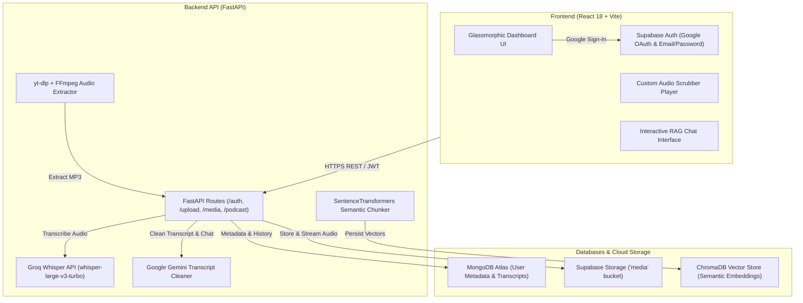

# 🎙️ VoxVault — AI Audio Intelligence & Retrieval Workspace

[](https://fastapi.tiangolo.com/)
[](https://reactjs.org/)
[](https://vitejs.dev/)
[](https://www.mongodb.com/)
[](https://supabase.com/)
[](https://groq.com/)
[](https://ai.google.dev/)

VoxVault is a full-stack, cloud-native **AI Audio Intelligence Workspace** designed to ingest, transcribe, analyze, and query audio content at scale. It transforms unstructured podcasts, local audio/video recordings, and YouTube video URLs into structured, searchable knowledge bases with interactive RAG (Retrieval-Augmented Generation) conversational AI.

---

## 📌 Table of Contents

- [Overview](#-overview)
- [System Architecture](#-system-architecture)
- [Key Features](#-key-features)
- [Technology Stack](#-technology-stack)
- [Repository Structure](#-repository-structure)
- [Setup & Installation Instructions](#-setup--installation-instructions)
- [Environment Variables](#-environment-variables)
- [Screenshots & UI Showcase](#-screenshots--ui-showcase)
- [Future Roadmap](#-future-roadmap)
- [License](#-license)

---

## 🌟 Overview

Modern podcasts and lecture recordings contain vast amounts of valuable information, but retrieving specific insights without listening to entire episodes is difficult. 

**VoxVault** solves this by providing an end-to-end ingestion and AI retrieval pipeline:
1. **Multi-Source Ingestion**: Upload local files (`.mp3`, `.mp4`, `.wav`), discover podcast RSS feeds, or paste direct **YouTube video URLs**.
2. **High-Speed Transcription**: Transcribes speech with sub-second latency using Groq Whisper (`whisper-large-v3-turbo`).
3. **Automated Cleaning & Structuring**: Cleans raw transcripts into formatted paragraphs using Google Gemini API.
4. **Vector Indexing & Semantic Search**: Embeds chunks using `SentenceTransformers` and indexes them in a persistent ChromaDB vector store.
5. **Grounded RAG Conversational AI**: Interactively ask questions about any media file and receive precise answers with timestamp citations.

---

## 🏗️ System Architecture



---

## ✨ Key Features

- **🔐 Dual Authentication**: Secure user login with Supabase Authentication (Google OAuth 2.0 & Email/Password) paired with server-side JWT verification.
- **📥 Multi-Source Media Ingestion**:
  - **Local Uploads**: Direct support for `.mp3`, `.mp4`, and `.wav` files with automated FFmpeg MP3 conversion.
  - **Podcast Discovery**: Scrape website URLs or parse raw RSS feeds into searchable episode lists.
  - **YouTube Direct Ingestion**: Paste any YouTube video link (`youtube.com` / `youtu.be`) to automatically extract high-quality audio using `yt-dlp`.
- **⚡ Rapid Speech-to-Text**: High-accuracy transcription powered by Groq Whisper (`whisper-large-v3-turbo`) with segment-level timestamping.
- **🧹 Intelligent Transcript Structuring**: Automated cleaning, punctuation, and paragraph formatting via Google Gemini AI.
- **💬 Interactive RAG Conversational Assistant**: Context-aware AI Q&A trained on individual media files, providing inline timestamp citations.
- **☁️ Cloud-First Storage Lifecycle**: Files are safely uploaded to Supabase Storage (`media` bucket), updating cloud URLs and automatically purging temporary server files.

---

## 🛠️ Technology Stack

### **Frontend**
- **Framework**: React 18, Vite
- **Styling**: Vanilla CSS (CSS Modules & Custom Design Tokens, Glassmorphism, Theme CSS Variables)
- **Icons & UI**: Lucide React, Google Material Symbols

### **Backend**
- **Framework**: FastAPI (Python 3.10+)
- **Server**: Uvicorn
- **Authentication**: PyJWT, Supabase Auth SDK

### **AI / Machine Learning**
- **Transcription**: Groq API (`whisper-large-v3-turbo`)
- **LLM & Clean-up**: Google Gemini API (`google-genai` SDK)
- **Vector Embeddings**: `sentence-transformers` (`all-MiniLM-L6-v2`)
- **Media Processing**: `yt-dlp`, FFmpeg

### **Databases & Cloud Services**
- **Database**: MongoDB Atlas (`voxvault_db`)
- **Cloud Storage**: Supabase Storage (`media` bucket)
- **Vector Store**: ChromaDB (Persistent Disk Storage)

---

## 📂 Repository Structure

```text
college project/
├── .env                          # Frontend Environment Variables
├── index.html                    # Main HTML entry point
├── package.json                  # Frontend dependencies & scripts
├── vite.config.js                # Vite bundler configuration
│
├── src/                          # FRONTEND REACT SOURCE
│   ├── main.jsx                  # Entry point
│   ├── App.jsx                   # Central App router & auth callback handler
│   ├── config.js                 # Centralized frontend configuration
│   ├── index.css                 # Glassmorphism design tokens & styles
│   └── components/               # React Components
│       ├── LandingPage.jsx       # Public landing page with glass cards
│       ├── Dashboard.jsx         # Media library & status filter grid
│       ├── Login.jsx             # User login modal
│       ├── Register.jsx          # User registration modal
│       ├── IngestionModal.jsx    # Media ingestion modal (File, Podcast, YouTube)
│       ├── MediaDetail.jsx       # Media workspace & audio player
│       ├── MediaPlayer.jsx       # Custom audio player with timestamp scrubbing
│       └── ChatInterface.jsx     # RAG conversational AI assistant
│
├── backend/                      # FASTAPI BACKEND SOURCE
│   ├── .env                      # Backend secrets & API keys
│   ├── requirements.txt          # Python dependencies
│   ├── migrate_historical_media.py # One-time historical local-to-cloud media migration script
│   └── app/                      # Backend App Package
│       ├── main.py               # FastAPI application & CORS config
│       ├── db.py                 # MongoDB Atlas connection manager
│       ├── auth_helper.py        # Supabase service client & JWT verification
│       ├── models/               # Pydantic schemas (User, Media, Transcript)
│       ├── routes/               # API Routers (auth.py, media.py, user.py)
│       ├── services/             # Core AI Services (ingestion, transcription, embeddings, chat)
│       └── utils/                # Utility helpers (FFmpeg audio, RSS, validators, source detector)
```

---

## 🚀 Setup & Installation Instructions

### **Prerequisites**
- **Node.js** (v18+) & **npm**
- **Python** (v3.10+)
- **FFmpeg** installed and added to system `PATH` (or Winget)
- **MongoDB Atlas** database cluster
- **Supabase Project** with an active `media` storage bucket
- **Groq API Key** & **Google Gemini API Key**

---

### 1️⃣ Clone the Repository
```bash
git clone https://github.com/your-username/voxvault.git
cd voxvault
```

---

### 2️⃣ Frontend Setup
```bash
# Install frontend dependencies
npm install

# Create root .env file
cp .env.example .env
```

Start the frontend development server:
```bash
npm run dev
```
*Frontend runs at `http://localhost:5173`.*

---

### 3️⃣ Backend Setup
```bash
# Navigate to backend directory
cd backend

# Create Python virtual environment
python -m venv venv

# Activate virtual environment
# Windows (PowerShell):
.\venv\Scripts\Activate.ps1
# Mac/Linux:
source venv/bin/activate

# Install dependencies
pip install -r requirements.txt

# Create backend .env file
cp .env.example .env
```

Start the backend FastAPI server:
```bash
python -m uvicorn app.main:app --reload --port 8000
```
*Backend API runs at `http://localhost:8000`.*

---

## 🔑 Environment Variables

### **Frontend Environment Variables (`/.env`)**
```env
VITE_SUPABASE_URL=https://your-supabase-project-id.supabase.co
VITE_SUPABASE_ANON_KEY=your_supabase_anon_key
VITE_API_BASE_URL=http://localhost:8000
```

### **Backend Environment Variables (`/backend/.env`)**
```env
MONGODB_URI=mongodb+srv://<username>:<password>@cluster.mongodb.net/voxvault_db?retryWrites=true&w=majority
MONGODB_DB_NAME=voxvault_db
SUPABASE_URL=https://your-supabase-project-id.supabase.co
SUPABASE_SERVICE_ROLE_KEY=your_supabase_service_role_key
GROQ_API_KEY=gsk_your_groq_api_key
GEMINI_API_KEY=your_gemini_api_key
ALLOWED_ORIGINS=http://localhost:5173,http://127.0.0.1:5173
```

---

## 📸 Screenshots & UI Showcase

| Glassmorphic Landing Page | User Media Dashboard |
| :---: | :---: |
|  |  |

| AI Chat Workspace | Media Ingestion Modal |
| :---: | :---: |
|  |  |

---

## 🛣️ Future Roadmap

- [ ] **Multi-Speaker Diarization**: Identify and label individual speakers in audio transcripts.
- [ ] **Export & PDF Reports**: Generate structured PDF summaries, key takeaways, and transcripts.
- [ ] **Real-time Live Audio Streaming**: Real-time microphone audio transcription and instant vector querying.
- [ ] **Global Language Translation**: Translate generated transcripts into 30+ languages automatically.

---

## 📄 License

Distributed under the MIT License. See `LICENSE` for more information.
